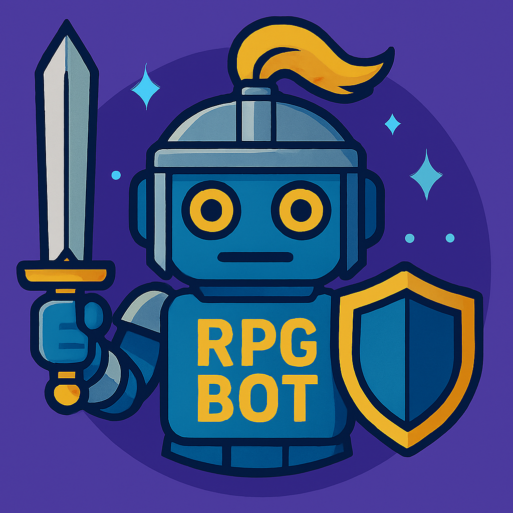
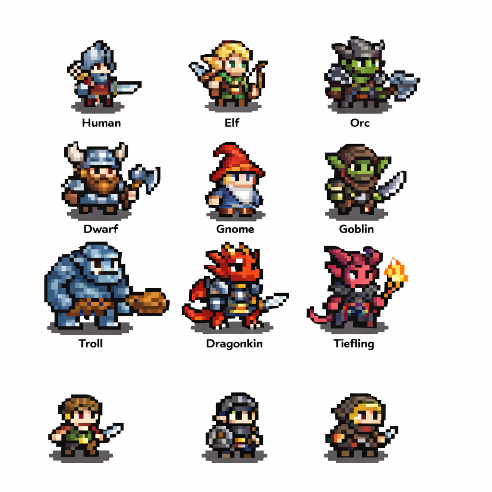

# RPGbot

<p align="center">
  
</p>

Un bot de Discord para juegos de rol con atmósfera de fantasía oscura, humor negro y decisiones fatídicas.  
Prepárate para perder monedas, cambiar de raza, retar a tus amigos y comprar extraños objetos a un mercader sombrío.

---

## Assets

Sprites de personajes por raza utilizados para selección, previsualización y generación de imágenes en comandos del bot.

<p align="center">
  
</p>

---

## Requisitos

- Python 3.10+
- MongoDB Atlas o MongoDB local
- Un bot de Discord registrado

---

## Instalación

1. Clona este repositorio.
2. Crea un entorno virtual:
   ```
   python -m venv venv
   ```
3. Activa el entorno virtual:
   - En Windows:
     ```
     venv\Scripts\activate
     ```
   - En Linux/Mac:
     ```
     source venv/bin/activate
     ```
4. Instala las dependencias:
   ```
   pip install -r requirements.txt
   ```
5. Crea un archivo `.env` en la raíz del proyecto con el siguiente contenido:
   ```
   DISCORD_TOKEN=tu_token_de_discord
   MONGO_URI=tu_cadena_de_conexion_mongodb
   RPGBOT_DB_NAME=RPGbot-db
   RPGBOT_COLLECTION_NAME=players
   ```

---

## Uso

1. Ejecuta el bot:
   ```
   python src/bot.py
   ```

2. Invita el bot a tu servidor de Discord.

---

## Comandos principales

- `!razas`  
  Consulta las razas disponibles para tu personaje.

- `!clases`  
  Descubre las clases que puedes elegir.

- `!elegir <número><letra>`  
  Elige tu raza y clase. Ejemplo: `!elegir 1A`

- `!perfil`  
  Muestra tu perfil actual, incluyendo tu inventario y riquezas.

- `!cambiar_raza <número>`  
  Cambia tu raza por un precio. Si tus monedas llegan a cero, tu personaje muere y deberás crear uno nuevo.

- `!cambiar_clase <letra>`  
  Cambia tu clase por un precio. Si tus monedas llegan a cero, tu personaje muere y deberás crear uno nuevo.

- `!duelo @usuario`  
  Reta a otro jugador a un duelo de dados. El ganador se lleva monedas del perdedor. Si un jugador queda en cero monedas, muere y debe crear un nuevo perfil.

- `!tienda`  
  Consulta los objetos que puedes comprar al mercader. Cada objeto tiene efectos únicos en los duelos.

- `!comprar <número>`  
  Compra un objeto de la tienda para tu inventario. Solo puedes tener un ejemplar de cada objeto especial.

- `!info`  
  Muestra la ayuda con todos los comandos, reglas y mecánicas especiales.

---

## Mecánicas y reglas

- Solo puedes crear tu perfil una vez con `!elegir`. Para cambiar raza o clase, usa los comandos correspondientes.
- Cambiar de raza o clase cuesta 200 monedas.
- Los duelos se resuelven con dados. El ganador obtiene monedas del perdedor.
- Si pierdes todas tus monedas, tu perfil será eliminado y deberás empezar de nuevo.
- Los objetos de la tienda pueden alterar el resultado de los duelos.
- Los objetos se usan automáticamente en los duelos si tienes alguno en tu inventario.
- Si tienes más de un objeto especial en tu inventario, se usará uno de manera aleatoria en el duelo.
- Solo puedes tener un ejemplar de cada objeto especial en tu inventario.

---

## Notas

- Si tu personaje llega a cero monedas, muere y debes crear un nuevo perfil con `!elegir`.
- Si retas a duelo a alguien que no tiene perfil, el bot lo mencionará y le dará instrucciones para crearlo.
- El bot utiliza un tono de fantasía oscura y humor negro en sus mensajes.
- Asegúrate de que tu bot tenga habilitado el intent de contenido de mensajes en el portal de desarrolladores de Discord.
- El bot almacena los perfiles de los usuarios en la colección y base de datos configuradas en el archivo `.env`.
- Puedes usar MongoDB Atlas o una instancia local de MongoDB para la persistencia.

---

